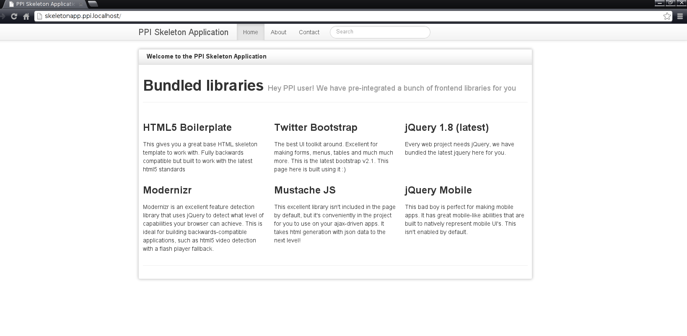

.. index::
   single: Getting started

Getting Started
===============

Downloading PPI
---------------

You can download the PPI skeletonaapp from the `PPI Homepage <http://www.ppi.io/>`_. If you just want everything in one folder ready to go, you should choose the **"ppi skeletonapp with vendors"** option.
Alternatively you can clone the repo. Notice the branch version is 2.1:

.. code-block:: bash

    $ git clone git@github.com:ppi/skeletonapp.git /path/to/skeletonapp
    $ cd /path/to/skeletonapp
    $ git checkout 2.1
    $ curl -s http://getcomposer.org/installer | php
    $ php composer.phar install
    $ mkdir {app/cache,app/logs} && chmod -R 777 {app/cache,app/logs}

System requirements
-------------------

PPI needs **PHP 5.3.10** or above and a web server with its rewrite module enabled (``mod_rewrite`` for Apache).

To easily check if your system passes all requirements, PPI provides two ways and we recommend you do both.

* First method is the **app/check** script, that can be run from the command line.
* Second method is the web based **check.php** script that's accessible via: http://skeletonapp.ppi/check.php

Why do we have both scripts? Because your CLI environment can have a separate **php.ini** file from your web environment so this will ensure you're good to go from both sides.

.. code-block:: bash

    $ php app/check

            _____   _____ |_|
           / __  | /  __ | /|
          | |__| || |__| || |
          |  ___/ |  ___/ | |
          | |     | |     |_|
          |/      |/

          Framework Version 2

        -- Requirements Check --

    * Configuration file used by PHP: /etc/php/cli-php5.4/php.ini
    * Mandatory requirements **

    OK       PHP version must be at least 5.3.3 (5.4.13--pl0-gentoo installed)
    OK       PHP version must not be 5.3.16 as PPI won't work properly with it
    OK       Vendor libraries must be installed
    OK       app/cache/ directory must be writable
    OK       app/logs/ directory must be writable
    OK       date.timezone setting must be set
    OK       Configured default timezone "Europe/Lisbon" must be supported by your installation of PHP
    OK       json_encode() must be available
    OK       session_start() must be available
    OK       ctype_alpha() must be available
    OK       token_get_all() must be available
    OK       simplexml_import_dom() must be available
    OK       detect_unicode must be disabled in php.ini
    OK       xdebug.show_exception_trace must be disabled in php.ini
    OK       xdebug.scream must be disabled in php.ini
    OK       PCRE extension must be available

Watch out for the green ``OK`` markers. If they all light up, congratulations, you're good to go!

----

Below is the list of required and optional requirements.

Required
~~~~~~~~

* PHP needs to be a minimum version of PHP 5.3.3
* JSON needs to be enabled
* ctype needs to be enabled
* Your PHP.ini needs to have the date.timezone setting

Optional
~~~~~~~~

* You need to have the PHP-XML module installed
* You need to have at least version 2.6.21 of libxml
* PHP tokenizer needs to be enabled
* mbstring functions need to be enabled
* iconv needs to be enabled
* POSIX needs to be enabled (only on \*nix)
* Intl needs to be installed with ICU 4+
* APC 3.0.17+ (or another opcode cache needs to be installed)
* PHP.ini recommended settings

  * ``short_open_tag = On``
  * ``magic_quotes_gpc = Off``
  * ``register_globals = Off``
  * ``session.autostart = Off``

DataSource
~~~~~~~~~~

If you want to use DataSource, you will need to have PDO installed. Additionally,
you need to have the PDO driver installed for the database server you want
to use.

Web Server Configuration
-------------------------

We take **security** seriously, as a result all your app code and configuration is kept hidden away outside of ``/public/``
and is inaccessible via the browser. Therefore we need to create a virtual host in order to route all web requests
to the ``/public/`` folder and from there your public assets (css/js/images) are loaded normally. The ``.htaccess`` or web server's rewrite rules
 kick in which route all non-asset files to ``/public/index.php``.

Apache Virtual Host
~~~~~~~~~~~~~~~~~~~

We are now creating an Apache virtual host for the application to make http://skeletonapp.ppi serve
``index.php`` from the ``skeletonapp/public`` directory.

.. code-block:: apache

    <VirtualHost *:80>
        ServerName    skeletonapp.ppi
        DocumentRoot  "/var/www/skeleton/public"
        SetEnv        PPI_ENV dev
        SetEnv        PPI_DEBUG true
    
        <Directory "/var/www/skeleton/public">
            AllowOverride All
            Allow from all
            DirectoryIndex index.php
            Options Indexes FollowSymLinks
        </Directory>
    </VirtualHost>
    
Nginx Virtual Host
~~~~~~~~~~~~~~~~~~~

.. code-block::nginx 

    server {
        listen 80;
        server_name skeletonapp.ppi;
        root /var/www/skeleton/public;
        index index.php;
        
        location / {
            try_files $uri /index.php$is_args$args;
        }
        
        location ~ \.php$ {
            fastcgi_pass 127.0.0.1:9000;
            include fastcgi_params;
            fastcgi_param SCRIPT_FILENAME $document_root$fastcgi_script_name;
            fastcgi_param HTTPS off;
        }
        
    }

You will need to update the ``/etc/hosts`` or ``c:\windows\system32\drivers\etc\hosts`` file so that your system knows
how to resolve ``skeletonapp.ppi``::

    127.0.0.1               skeletonapp.ppi

Restart your web server. The skeletonapp website can now be accessed using http://skeletonapp.ppi. Welcome!

----

Now that your environment is properly set up move to the :doc:`/book/application` section to see an overview of the
directory structure and learn the basics on how to configure the framework.
